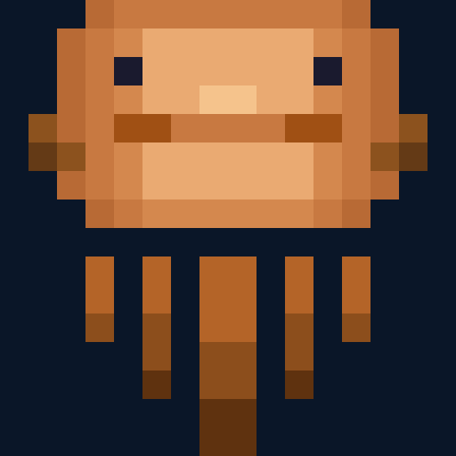

<p align="center">
  
</p>

<h1 align="center">Cuttlefish</h1>

<p align="center">
  <strong>A persistent, device-agnostic agentic coding platform built in Rust</strong>
</p>

<p align="center">
  <a href="#vision">Vision</a> |
  <a href="#current-status">Current Status</a> |
  <a href="#architecture">Architecture</a> |
  <a href="#installation">Installation</a> |
  <a href="#configuration">Configuration</a> |
  <a href="#contributing">Contributing</a>
</p>

<p align="center">
  <strong>Downloads:</strong>
  <a href="https://github.com/JackTYM/cuttlefish-rs/releases/tag/server-latest">Server Latest</a> |
  <a href="https://github.com/JackTYM/cuttlefish-rs/releases/tag/tui-latest">TUI Latest</a> |
  <a href="https://github.com/JackTYM/cuttlefish-rs/tags?q=versions-server">All Server Releases</a> |
  <a href="https://github.com/JackTYM/cuttlefish-rs/tags?q=versions-tui">All TUI Releases</a>
</p>

---

## Vision

Cuttlefish is a persistent, multi-agent coding assistant that runs on a server and can be accessed from anywhere. Start a project on your desktop, continue it from your phone, and pick up right where you left off - including running background processes.

### Core Principles

1. **Multi-Agent System**: Specialized agents (Planner, Coder, Critic, etc.) collaborate on complex tasks
2. **Multi-Model Routing**: Route each agent to the optimal model for its task category
3. **Project Isolation**: Every project runs in its own Docker container
4. **Interface Agnostic**: Same backend accessible via WebUI, TUI, Discord, or other clients
5. **BYOK (Bring Your Own Keys)**: Users provide their own API keys - no proxying
6. **Zero Unsafe Code**: The entire Rust codebase is `#![deny(unsafe_code)]`

### Why "Cuttlefish"?

The cuttlefish adapts its color and texture to match any environment. This platform adapts its interface (Discord, WebUI, TUI) and its intelligence (routing to different models) based on the task and context.

---

## Current Status

> **Note**: Cuttlefish is in active development. Core functionality is now working end-to-end.

### What's Working

| Component | Status | Notes |
|-----------|--------|-------|
| Core infrastructure | Complete | Error types, config, traits |
| Database layer | Complete | SQLite with full schema |
| Model providers | Complete | 11 providers supported |
| Agent definitions | Complete | All agents implemented |
| Safety system | Complete | Confidence scoring, gates, REST routes |
| Memory system | Complete | Project memory, branching |
| Docker sandbox | Complete | Container lifecycle + API routes |
| API routes | Complete | All routes implemented with real backends |
| WebSocket | Complete | Routes to agent workflow engine |
| WebUI | Complete | Full UI with working backend |
| TUI | Complete | Full terminal client with WebSocket |
| Discord bot | Complete | Event handler, commands, startup from config |
| Provider testing | Complete | Makes real API calls to verify |
| Safety workflow | Complete | Approval registry with async wait |
| Architecture docs | Complete | Protocol specs in `/docs/architecture/` |
| Integration tests | Complete | End-to-end tests in `tests/integration/` |

### What Needs Work

- **Logs Page Verification**: WebUI logs page needs testing with real WebSocket messages

See [CLAUDE.md](CLAUDE.md) for detailed implementation status and fix priorities.

---

## Architecture

### Crate Structure

```
cuttlefish-rs/
├── src/main.rs                    # Server binary entry point
├── cuttlefish-web/                # Nuxt 3 WebUI
└── crates/
    ├── cuttlefish-core/           # Shared traits, config, errors
    ├── cuttlefish-db/             # SQLite persistence (sqlx)
    ├── cuttlefish-providers/      # Model providers (11 supported)
    ├── cuttlefish-sandbox/        # Docker container management
    ├── cuttlefish-vcs/            # Git operations + GitHub API
    ├── cuttlefish-agents/         # Agent system
    ├── cuttlefish-discord/        # Discord bot
    ├── cuttlefish-api/            # HTTP/WebSocket server
    ├── cuttlefish-tui/            # Terminal client
    └── cuttlefish-tunnel/         # Reverse tunnel for remote access
```

### Agent System

The agent system implements a Planner -> Coder -> Critic loop:

| Agent | Role | Default Category |
|-------|------|------------------|
| **Orchestrator** | Coordinates agents, manages lifecycle | `deep` |
| **Planner** | Creates implementation plans | `ultrabrain` |
| **Coder** | Writes code, runs builds | `deep` |
| **Critic** | Reviews code, approves/rejects | `unspecified-high` |
| **Explorer** | Searches codebases | `quick` |
| **Librarian** | Retrieves documentation | `quick` |
| **DevOps** | Handles builds, deployments | `unspecified-high` |

### Model Categories

| Category | Use Case | Typical Model |
|----------|----------|---------------|
| `ultrabrain` | Hard logic, architecture | claude-opus-4-6 |
| `deep` | Complex autonomous work | claude-sonnet-4-6 |
| `quick` | Fast simple tasks | claude-haiku-4-5 |
| `visual` | Frontend, UI/UX | gemini-2.0-flash |
| `unspecified-high` | General higher effort | claude-sonnet-4-6 |
| `unspecified-low` | General lower effort | claude-haiku-4-5 |

### Supported Providers

| Provider | Auth | Notes |
|----------|------|-------|
| Anthropic | API Key | Claude models |
| OpenAI | API Key | GPT models |
| AWS Bedrock | IAM | Enterprise Claude |
| Google Gemini | API Key | Gemini models |
| Moonshot (Kimi) | API Key | Chinese market |
| Zhipu (GLM) | API Key | Chinese market |
| MiniMax | API Key + Group ID | Fast utility |
| xAI (Grok) | API Key | Code search |
| Ollama | None (local) | Privacy, offline |
| Claude OAuth | PKCE | Personal accounts |
| ChatGPT OAuth | Bearer | Personal accounts |

---

## Installation

### Quick Install (Recommended)

```bash
sudo bash -c "$(curl -fsSL https://raw.githubusercontent.com/JackTYM/cuttlefish-rs/master/install.sh)"
```

This installs the latest release to `/opt/cuttlefish` and creates a `cuttlefish` command in your PATH.

### Uninstall

```bash
sudo bash -c "$(curl -fsSL https://raw.githubusercontent.com/JackTYM/cuttlefish-rs/master/uninstall.sh)"
```

### Prerequisites (for building from source)

- Rust 1.94.0+ (`rustup install 1.94.0`)
- Docker (for project sandboxes)
- Git

### Build from Source

```bash
# Clone
git clone https://github.com/JackTYM/cuttlefish-rs.git
cd cuttlefish-rs

# Build WebUI (requires Node.js 18+)
cd cuttlefish-web
npm install
npm run generate
cd ..

# Build with embedded WebUI
export WEBUI_DIR="$(pwd)/cuttlefish-web/.output/public"
cargo build --release

# Configure
cp cuttlefish.example.toml cuttlefish.toml
# Edit cuttlefish.toml with your settings

# Run (set env vars for your configured providers)
export CUTTLEFISH_API_KEY="your-secure-api-key"
./target/release/cuttlefish-rs
```

### Build without WebUI

```bash
# If you don't need the WebUI, just build without setting WEBUI_DIR
cargo build --release
# The server will run API-only mode
```

### Docker Deployment

```bash
docker build -t cuttlefish .
docker run -d \
  -v /var/run/docker.sock:/var/run/docker.sock \
  -v $(pwd)/cuttlefish.toml:/etc/cuttlefish/cuttlefish.toml \
  -e CUTTLEFISH_API_KEY="your-key" \
  -p 8080:8080 \
  cuttlefish
```

---

## Configuration

### Configuration Files

| File | Purpose |
|------|---------|
| `cuttlefish.toml` | Main configuration (gitignored) |
| `cuttlefish.example.toml` | Example with defaults |
| `/etc/cuttlefish/cuttlefish.toml` | System-wide (production) |

### Key Environment Variables

```bash
CUTTLEFISH_API_KEY      # Required: API authentication
CUTTLEFISH_JWT_SECRET   # JWT signing (defaults to API key)
DISCORD_BOT_TOKEN       # For Discord bot
RUST_LOG                # Log level (info, debug, trace)

# Provider keys (as needed)
ANTHROPIC_API_KEY
OPENAI_API_KEY
GOOGLE_API_KEY
AWS_ACCESS_KEY_ID
AWS_SECRET_ACCESS_KEY
```

### Example Configuration

```toml
[server]
host = "127.0.0.1"
port = 8080

[database]
path = "cuttlefish.db"

[sandbox]
docker_socket = "unix:///var/run/docker.sock"
memory_limit_mb = 2048
cpu_limit = 2.0

[auto_update]
enabled = true
poll_interval_secs = 3600  # Check every hour
auto_apply = true
download_dir = "/var/cache/cuttlefish"  # Must be writable by the service

[providers.claude]
provider_type = "bedrock"
model = "anthropic.claude-sonnet-4-6-20260101-v1:0"
region = "us-east-1"

[agents.orchestrator]
category = "deep"

[agents.coder]
category = "deep"

[agents.critic]
category = "unspecified-high"
```

### Manual Setup (Auto-Update)

If installing manually (not using `install.sh`), create the cache directory for auto-updates:

```bash
# Create cache directory for auto-update downloads
sudo mkdir -p /var/cache/cuttlefish
sudo chown cuttlefish:cuttlefish /var/cache/cuttlefish

# If using systemd, add to ReadWritePaths in service file:
# ReadWritePaths=/var/lib/cuttlefish /var/log/cuttlefish /var/cache/cuttlefish
```

Without this, auto-updates will fail with "Permission denied" when downloading.

---

## Usage

### Server

```bash
# Development
cargo run

# Production
./target/release/cuttlefish-rs

# With custom config
./target/release/cuttlefish-rs --config /path/to/config.toml
```

### CLI Commands

```bash
# Template validation
cuttlefish-rs validate-templates [DIR]

# Usage statistics
cuttlefish-rs usage [--project ID] [--daily|--weekly|--monthly]

# Cost tracking
cuttlefish-rs costs [--export path.csv]

# Project memory
cuttlefish-rs memory [PROJECT_PATH]

# Decision tracing
cuttlefish-rs why <FILE>

# State branching
cuttlefish-rs branch list|create|restore|delete [NAME]

# Checkpoints
cuttlefish-rs checkpoint [create|list]
cuttlefish-rs rollback <ID|--latest>

# Safety configuration
cuttlefish-rs safety config [--auto-approve THRESHOLD] [--prompt THRESHOLD]

# Tunnel management
cuttlefish-rs tunnel connect|status|disconnect
```

### API Endpoints

| Endpoint | Purpose |
|----------|---------|
| `GET /health` | Health check |
| `ws://host/ws` | WebSocket for clients |
| `GET /api/projects` | List projects |
| `POST /api/projects` | Create project |
| `GET /api/templates` | List templates |
| `GET /api/system/config` | Get configuration |
| `PUT /api/system/config` | Update configuration |

---

## Development

### Building

```bash
cargo build --workspace            # Debug
cargo build --release --workspace  # Release
cargo test --workspace             # Run tests
cargo clippy --workspace -- -D warnings  # Lint
cargo fmt --all                    # Format
```

### Code Standards

- **Edition**: Rust 2024
- **MSRV**: 1.94.0
- **No unsafe**: `#![deny(unsafe_code)]` workspace-wide
- **No unwrap**: `#![deny(clippy::unwrap_used)]` in library crates
- **Errors**: `thiserror` for libraries, `anyhow` for binaries
- **Logging**: `tracing` macros only, no `println!`

### Commit Convention

Format: `<type>(<crate>): <description>`

Types: `feat`, `fix`, `refactor`, `test`, `docs`, `chore`

Example: `feat(api): wire WebSocket to orchestrator agent`

---

## Contributing

1. Fork the repository
2. Read [CLAUDE.md](CLAUDE.md) for detailed architecture and fix priorities
3. Create a feature branch
4. Write tests (TDD preferred)
5. Ensure `cargo test --workspace` passes
6. Ensure `cargo clippy --workspace -- -D warnings` is clean
7. Submit a pull request

### Priority Areas

These areas need the most attention:

1. **Wire WebSocket to agents** - Core functionality gap
2. **Complete TUI client** - Currently a stub
3. **Add real-time log streaming** - WebUI expects it
4. **Test provider connections** - Settings page stub

---

## Inspirations

- **OmO / Sisyphus Labs**: Category-based routing, multi-agent orchestration
- **OpenClaw**: Gateway control plane, multi-interface design
- **Moltis**: Large Rust workspace patterns, zero unsafe

---

## License

MIT License - see [LICENSE](LICENSE) for details.

---

<p align="center">
  Made with Rust
</p>
